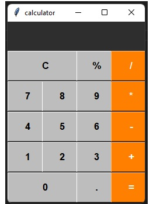

<h1> Calculator </h1><!-- Calculadora -->

<h3> Objectives </h3><!-- Objetivos -->
Create a calculator using Python.
<!-- Criar uma calculadora utilizando Python -->
 
 

 
 

<h3> Imports </h3><!-- Importações -->
Tkinter was used to create the layout.
<!-- Foi utilizado tkinter para criação do layout -->
